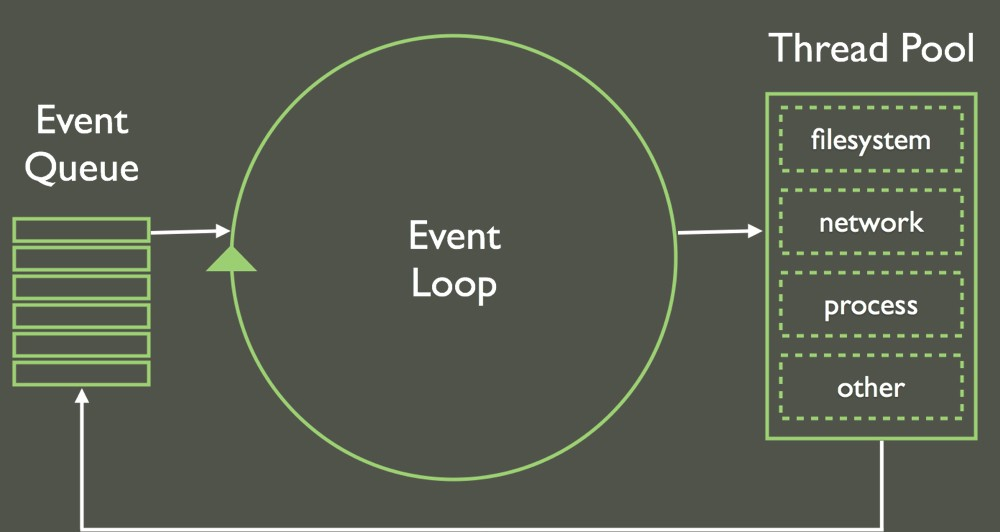

# fundamentos_node

# Node.Js

# Características do Node.js

* Arquitetura Event Loop
   *  Call Stack
* Single - Thread
* Non-Blocking I/O
* Módulos próprios
    * HTTP
    * DNS
    * FS
    * Buffer

# Tipos de parâmetros

* Route Params --> Indetificar um recurso (editar | deletar | buscar)
* Query Params --> Paginação (Filtro)
* Body Params --> Os objetos (inserção | alteração) JSON
